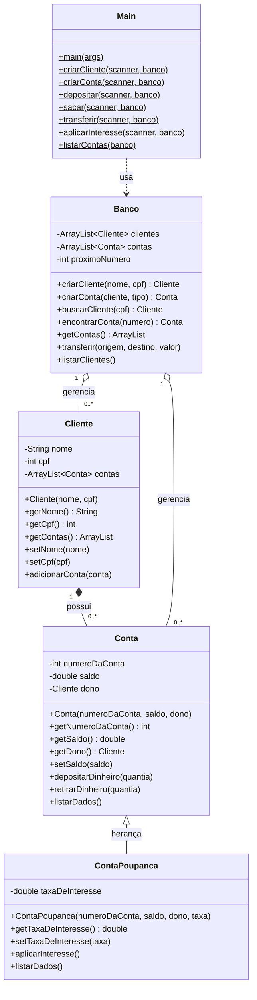

# 🏦 Sistema Bancário em Java

<div align="center">


*Projeto educacional de simulação de um sistema bancário desenvolvido em Java, com foco na aplicação dos pilares da Programação Orientada a Objetos.*

</div>

---
## 👥 Desenvolvedores
- KEVEN SILVA TEIXEIRA
- ARTHUR HENRIQUE NASCIMENTO
- LUCAS ALMEIDA PAIVA LUNA

---

## 📋 Índice

- [Sobre o Projeto](#-sobre-o-projeto)
- [Funcionalidades](#-funcionalidades)
- [Estrutura de Arquivos](#-estrutura-de-arquivos)
- [Diagrama de Classes](#-diagrama-de-classes)
- [Descrição das Classes](#-descrição-das-classes)
- [Conceitos de POO Aplicados](#-conceitos-de-poo-aplicados)
- [Como Executar](#-como-executar)
- [Exemplo de Uso](#-exemplo-de-uso)

---

## 💡 Sobre o Projeto

Este projeto simula as operações básicas de um sistema bancário via terminal. O objetivo principal é **demonstrar na prática os quatro pilares da Programação Orientada a Objetos (POO)**: encapsulamento, herança, polimorfismo e abstração.

O sistema permite cadastrar clientes, abrir contas correntes e poupanças, realizar depósitos, saques, transferências e aplicar juros mensais sobre contas poupança — tudo gerenciado por um menu interativo no console. (Sem GUI 😭)

---

## ✅ Funcionalidades

| # | Funcionalidade | Descrição |
|---|---|---|
| 1 | **Criar Cliente** | Cadastra um novo cliente com nome e CPF |
| 2 | **Criar Conta** | Abre conta corrente ou poupança para um cliente existente |
| 3 | **Depositar** | Adiciona saldo a uma conta pelo número |
| 4 | **Sacar** | Remove saldo de uma conta com validação de limite |
| 5 | **Transferir** | Move saldo entre duas contas com validações completas |
| 6 | **Aplicar Juros** | Aplica taxa de juros mensal em contas poupança |
| 7 | **Listar Contas** | Exibe todas as contas com seus respectivos dados |
| 8 | **Listar Clientes** | Exibe todos os clientes e suas contas vinculadas |

---

## 📁 Estrutura de Arquivos

```
sistema-bancario/
│
├── Main.java           # Ponto de entrada — menu interativo e fluxo principal
├── Banco.java          # Gerencia clientes, contas e operações bancárias
├── Cliente.java        # Representa um cliente do banco
├── Conta.java          # Representa uma conta corrente genérica
└── ContaPoupanca.java  # Especialização de Conta com taxa de juros
```

---

## 📊 Diagrama de Classes



---

## 📦 Descrição das Classes

### 🧍 `Cliente`
Representa um correntista do banco. Armazena dados pessoais e mantém uma lista de contas vinculadas.

**Responsabilidades:**
- Guardar nome e CPF do cliente
- Manter a lista de contas associadas a ele
- Permitir que novas contas sejam vinculadas via `adicionarConta()`

---

### 💳 `Conta`
Classe base que modela uma **conta corrente**. Contém a lógica fundamental de movimentação financeira.

**Responsabilidades:**
- Armazenar número da conta, saldo e referência ao dono
- Validar e executar depósitos e saques
- Exibir os dados da conta via `listarDados()`

> ⚠️ O setter `setSaldo()` protege o saldo contra valores negativos. O método `retirarDinheiro()` impede saques acima do saldo disponível.

---

### 💰 `ContaPoupanca`
**Herda de `Conta`** e acrescenta a funcionalidade de rendimento por juros. Representa uma conta poupança.

**Responsabilidades:**
- Armazenar e gerenciar a taxa de juros mensal
- Calcular e aplicar rendimento sobre o saldo com `aplicarInteresse()`
- Sobrescrever `listarDados()` para incluir a taxa de juros na exibição

**Fórmula de juros aplicada:**
```
novoSaldo = saldoAtual × (1 + taxaDeInteresse / 100)
```
*Exemplo: saldo de R$ 1.000,00 com taxa de 2% → R$ 1.020,00*

---

### 🏛️ `Banco`
Classe central do sistema. Atua como um **repositório e controlador** de clientes e contas.

**Responsabilidades:**
- Gerenciar as listas de clientes e contas com `ArrayList`
- Gerar números únicos de conta com contador auto-incremental
- Criar clientes e contas do tipo correto (corrente ou poupança)
- Realizar buscas por CPF e por número de conta
- Orquestrar transferências com todas as validações necessárias
- Listar clientes e suas contas associadas

---

### 🖥️ `Main`
Classe de apresentação. Contém o **menu interativo** e os métodos que fazem a ponte entre o usuário e a lógica do sistema.

**Responsabilidades:**
- Exibir o menu e capturar a opção do usuário com `Scanner`
- Direcionar cada opção para o método estático correto via `switch`
- Coletar os dados necessários do usuário para cada operação
- Tratar os retornos `null` quando cliente ou conta não são encontrados

---

## 🧩 Conceitos de POO Aplicados

### 🔒 1. Encapsulamento
> *"Proteger os dados internos de um objeto, expondo apenas o necessário."*

Todos os atributos das classes são declarados como `private`, impedindo acesso direto externo. O acesso é feito exclusivamente por **getters e setters**, que permitem aplicar validações antes de alterar os dados.

```java
// Atributo privado — ninguém acessa diretamente
private double saldo;

// Setter com validação — protege contra saldo negativo
public void setSaldo(double saldo) {
    if (saldo < 0) {
        System.out.println("Saldo negativo não é permitido.");
        return;
    }
    this.saldo = saldo;
}
```

---

### 🧬 2. Herança
> *"Reaproveitar atributos e métodos de uma classe em outra mais específica."*

`ContaPoupanca` herda de `Conta` usando a palavra-chave `extends`. Com isso, ela recebe automaticamente todos os atributos e métodos de `Conta` (número, saldo, depósito, saque etc.) e apenas **acrescenta** o que é exclusivo de uma poupança: a `taxaDeInteresse` e o método `aplicarInteresse()`.

```java
// ContaPoupanca herda tudo de Conta
public class ContaPoupanca extends Conta {

    private double taxaDeInteresse;

    public ContaPoupanca(int numeroDaConta, double saldo, Cliente dono, double taxa) {
        super(numeroDaConta, saldo, dono); // Reutiliza o construtor da classe pai
        this.taxaDeInteresse = taxa;
    }
}
```

---

### 🎭 3. Polimorfismo
> *"O mesmo método se comporta de formas diferentes dependendo do tipo do objeto."*

**Polimorfismo de sobrescrita (`@Override`):** `ContaPoupanca` sobrescreve o método `listarDados()` de `Conta` para exibir também a taxa de juros. Quando `listarDados()` é chamado, o Java executa automaticamente a versão correta para cada tipo de objeto.

```java
// Em Conta.java
public void listarDados() {
    System.out.println("Número da conta: " + numeroDaConta);
    System.out.println("Saldo: " + saldo);
    System.out.println("Dono: " + dono.getNome());
}

// Em ContaPoupanca.java — comportamento estendido
@Override
public void listarDados() {
    super.listarDados();  // Executa o método do pai primeiro
    System.out.println("Taxa de interesse: " + taxaDeInteresse + "%"); // Depois acrescenta o extra
}
```

**Polimorfismo com `instanceof`:** Em `Main`, o sistema verifica em tempo de execução se uma `Conta` é na verdade uma `ContaPoupanca` antes de aplicar juros.

```java
if (conta instanceof ContaPoupanca) {
    ContaPoupanca poupanca = (ContaPoupanca) conta; // Cast seguro após a verificação
    poupanca.aplicarInteresse();
} else {
    System.out.println("Essa conta não é do tipo poupança.");
}
```

---

### 🗂️ 4. Abstração
> *"Modelar entidades do mundo real, expondo apenas o que é relevante."*

Cada classe modela um conceito real do domínio bancário — `Cliente`, `Conta`, `ContaPoupanca`, `Banco` — escondendo a complexidade interna. Quem chama `conta.depositarDinheiro(500)` não precisa saber *como* o depósito é processado internamente, apenas *que* ele será realizado com as devidas validações.

```java
// O usuário da classe só precisa saber que este método existe
// A implementação interna (validação, atualização de saldo, exibição) fica escondida
conta.depositarDinheiro(500.00);
```

A **separação de responsabilidades** entre as classes também é uma forma de abstração: `Banco` gerencia, `Conta` opera, `Cliente` representa, e `Main` apresenta.

---

## 🚀 Como Executar

**Pré-requisitos:** Java 17 ou superior instalado.

```bash
# 1. Clone o repositório
git clone https://github.com/seu-usuario/sistema-bancario.git
cd sistema-bancario

# 2. Compile todos os arquivos
javac *.java

# 3. Execute o programa
java Main
```

---

## 🖱️ Exemplo de Uso

```
======= MENU =======
1 - Criar cliente
2 - Criar conta
3 - Depositar
...
Escolha uma opção:
> 1
Nome:
> João Silva
CPF:
> 12345678
Cliente criado!

Escolha uma opção:
> 2
CPF do cliente:
> 12345678
Tipo (corrente/poupança):
> poupança
Conta criada!

Escolha uma opção:
> 3
Número da conta:
> 1
Valor:
> 1000
Saldo Anterior: 0.0
Novo Saldo: 1000.0
```

---

<div align="center">
  <sub>Desenvolvido com fins educacionais para aprendizado e apresentação de trabalho de POO em Java.</sub>
</div>
